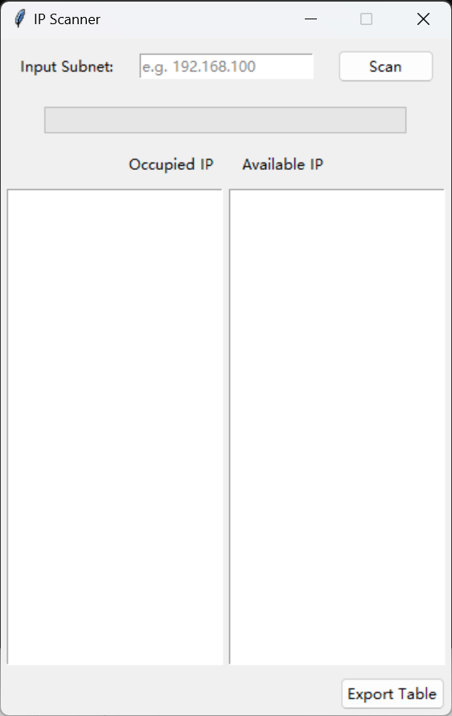
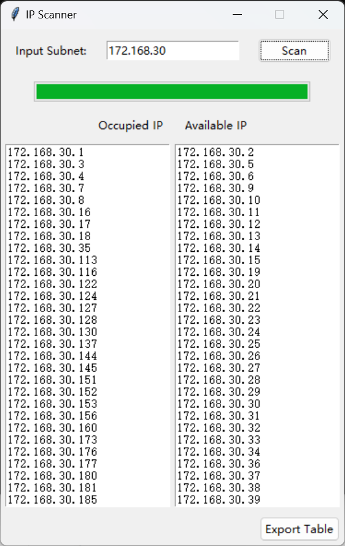

# IP Scanner

多线程ping指定网段IP地址

<div style="display: flex; justify-content: space-around;">
    
    
</div>

### 部署

conda/mamba环境
```cmd
mamba create -n ipsacnner python=3.10
```

venv环境
```cmd
python -m venv .venv
call .venv/Scripts/activate
```

安装
```cmd
pip install -r requirements.txt
```

### 打包

```cmd
pyinstaller --onefile --name=IPScanner --icon=assets/favicon.ico app.py
```